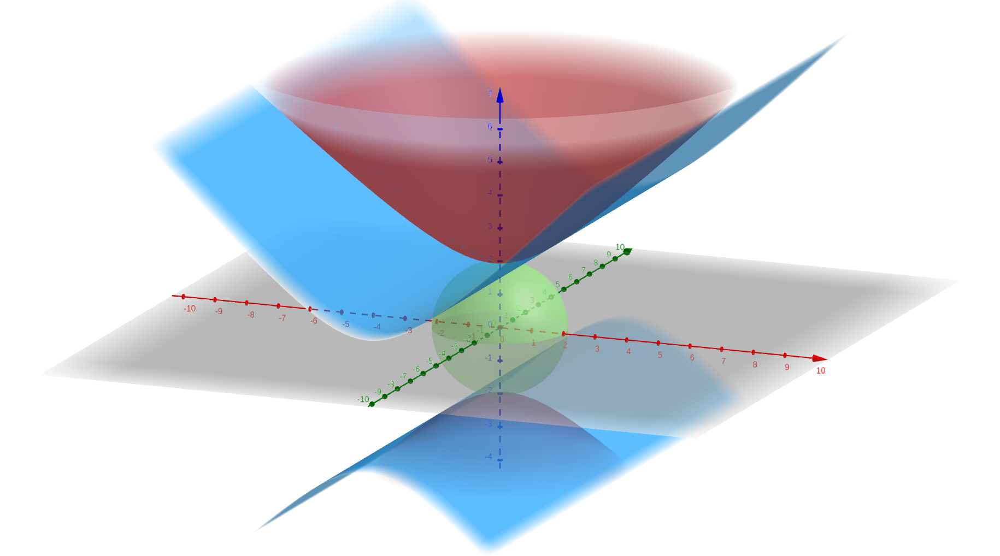

# Determinant

A *determinant* of a square matrix of the size 2x2 and 3x3:

2x2:
$$
\begin{gathered}
    \begin{vmatrix}
        a & b \\
        c & d
    \end{vmatrix} = \det \begin{pmatrix}
        a & b \\
        c & d
    \end{pmatrix} = ad - bc
\end{gathered}
$$

It represents the area of a parallelogram made from the vectors $\binom{a}{c}$,
$\binom{b}{d}$.

$$
\begin{gathered}
    \begin{vmatrix}
        a & b & c \\
        d & e & f \\
        g & h & i
    \end{vmatrix} = \det \begin{pmatrix}
        a & b & c \\
        d & e & f \\
        g & h & i
    \end{pmatrix} = a \begin{vmatrix}
        e & f \\ h & i
    \end{vmatrix} - d \begin{vmatrix}
        b & c \\ h & i
    \end{vmatrix} + g \begin{vmatrix}
        b & c \\ e & f
    \end{vmatrix}
\end{gathered}
$$

It represents the area of a *parallelepiped* (3D object made up of 6
parallelograms).

# Vector Multiplication

#### Symbol:

$\land$ or $\times$

A vector ($\in \mathbb{R}^3$) $\land$ a vector ($\in \mathbb{R}^3$) $=$ a vector ($\in \mathbb{R}^3$).

$$\begin{pmatrix}
    a_1 \\ a_2 \\a_3
\end{pmatrix} \land \begin{pmatrix}
    b_1 \\ b_2 \\ b_3
\end{pmatrix} = \begin{pmatrix}
    \phantom{-} \begin{vmatrix}
        a_2 & b_2 \\
        a_3 & b_3
    \end{vmatrix} \\
    \\
    - \begin{vmatrix}
        a_1 & b_1 \\
        a_3 & b_3
    \end{vmatrix} \\
    \\
    \phantom{-} \begin{vmatrix}
        a_1 & b_1 \\
        a_2 & b_2
    \end{vmatrix}
\end{pmatrix} = \begin{pmatrix}
    a_2b_3 - a_3b_2 \\
    a_3b_1 - a_1b_3 \\
    a_1b_2 - a_2b_1
\end{pmatrix}$$

$$\underline a \land \underline b = \underline{\hat i}
    \begin{vmatrix}
        a_2 & b_2 \\
        a_3 & c_3
    \end{vmatrix}
    - \underline{\hat j} \begin{vmatrix}
        a_1 & b_1 \\
        a_3 & b_3
    \end{vmatrix}
    + \underline{\hat k} \begin{vmatrix}
        a_1 & b_1 \\
        a_2 & b_2
    \end{vmatrix}
$$
$$= \begin{vmatrix}
    \underline{\hat i} & a_1 & b_1 \\
    \underline{\hat j} & a_2 & b_2 \\
    \underline{\hat k} & a_3 & b_3
\end{vmatrix}$$

### Characteristics

1. $\underline a \land \underline b$ is perpendicular to both $\underline a$
   and $\underline b$
2. $||\underline a \land \underline b|| = ||\underline a|| \cdot ||\underline b|| \sin \theta$

## Triple scalar product ($\in \mathbb{R}^3$)

Given $\underline a, \underline b, \underline c \in \mathbb{R}^3$, their
*triple scalar product* is:

$$
[\underline a, \underline b, \underline c] =
\begin{vmatrix}
    a_1 & b_1 & c_1 \\
    a_2 & b_2 & c_2 \\
    a_3 & b_3 & c_3
\end{vmatrix} = \underline a \cdot (\underline b \land \underline c)$$

# Chapter 2

# Parametric expression of a plane

## Circle

Equation: $x^2+y^2=1$

Parametric: ${\cos t \choose \sin t}_{0 \leq t \leq 2 \pi}$

Two operations on shapes:

1. Transformation by a vector $a \choose b$
2. Stretching by $c$ width-wise, $d$ height-wise

Given parameterization $x(t) \choose y(t)$ or an equation $T(x,y)$:

Transformation by a vector $a \choose b$:
$${x(t) + a \choose y(t) + b} \quad T(x-a, y-b)$$

Stretching by $c$ width-wise, $d$ height-wise:
$${c \cdot x(t) \choose d \cdot y(t)} \quad T\left(\frac{x}{c}, \frac{y}{d}\right)$$

## Hyperbola

$$xy=c \implies y=\frac{c}{x}$$

\begin{center}
\begin{tikzpicture}
\begin{axis}[
    axis lines = left,
    xlabel = \(x\),
    ylabel = {\(y\)},
    xmin=-10, xmax=10,
    ymin=-10, ymax=10,
]
%Below the red parabola is defined
\addplot [
    domain=-10:10,
    samples=100,
    color=red,
]
{5/x};
\addlegendentry{\(\frac{c}{x}, c > 0\)}
%Here the blue parabola is defined
\addplot [
    domain=-10:10,
    samples=100,
    color=blue,
    ]
    {-5/x};
\addlegendentry{\(\frac{c}{x}, c < 0\)}

%Here the blue parabola is defined
\addplot [
    domain=-10:10,
    samples=100,
    color=green,
    ]
    {0};
\addlegendentry{\(\frac{c}{x}, c = 0\)}

\end{axis}
\end{tikzpicture}
\end{center}>

Let's rotate this function $45 \degree$ counter-clockwise:

\begin{center}
\begin{tikzpicture}
\begin{axis} [
  no markers,
  axis lines = middle,
  axis line style = {->},
  xlabel = {$x$},
  ylabel = {$y$},
  xticklabels={,,}
  yticklabels={,,},
  % added this
  anchor=origin,
  xmin=-5, xmax=5,
  ymin=-5, ymax=5,
  ]
  \end{axis}

  \begin{axis} [ % added this
    rotate around={-45:(current axis.origin)},
    anchor=origin,
    hide axis,
    ]
    \addplot[color=red,samples=200] {5/x};  %statement 1
    \addplot[color=blue,samples=200] {-5/x}; %statement 2
    \addplot[color=green,samples=200] {0}; %statement 3
  \end{axis}
\end{tikzpicture}
\end{center}

To define our new function, we now define ${u,v}$ on the plane in how they
relate to our initial $(x,y)$

We can do this by using projections of $x$ and $y$ onto our new $u, x$ axises:

$$
\begin{gathered}
    u = (x,y) \cdot \underbrace{\left( \frac{1}{\sqrt 2}, \frac{1}{\sqrt 2}\right)}_{\text{Unit vector of $u$}} = \frac{1}{\sqrt 2}( x+y) \\
    u = (x,y) \cdot \underbrace{\left(-\frac{1}{\sqrt 2}, \frac{1}{\sqrt 2}\right)}_{\text{Unit vector of $v$}} = \frac{1}{\sqrt 2}(-x+y)
\end{gathered}
$$

Conclusion:

$$
\begin{gathered}
    uv = \alpha \\
    y^2 - x^2 = \frac{\alpha}{2} \\
    x^2 - y^2 = c \iff uv = -\frac{c}{2}
\end{gathered}
$$

After stretching by $a$ in the direction of the $x$-axis and by $b$ in the
direction of the $y$-axis:

$$\frac{x^2}{a^2} - \frac{y^2}{b^2} = c$$

With the new asymptotes being:

$$y=\pm x \implies y=\pm x \cdot \frac{b}{a}$$

## Polar Coordinates

Besides for the *Cartesian* coordinate system (which is defined by how far a
point is from the $x$ and $y$-axis), we have the *polar* coordinate system,
which is defined by the distance between the point and the origin (radius $r$) and
the angle between the $x$-axis and the point (angle, $\theta$).

Converting between representations:
$$
\begin{gathered}
  x \to r \cos \theta \quad y \to r \sin \theta \\
  r = \sqrt{x^2+y^2} \quad \theta = \arctan\left(\frac{y}{x}\right)\underbrace{(+ \pi)}_{\text{If $x<0$}} +2 \pi k
\end{gathered}
$$

A circle shifted by $a$ to horizontally with a radius of $a$:

$$
\begin{gathered}
    (x-a)^2+y^2=a^2 \\
    r = 2a \cos \theta
\end{gathered}
$$

## Cylindrical Coordinates

The *cylindrical coordinate system* is essentially the polar system just with a
third dimension $z$, where the radius is the distance from the $z$-axis (rho,
$\rho$), the angle ($\theta$), and z ($z$), such that:

$$x = \rho \cos \theta \quad y = \rho \sin \theta \quad z = z$$

## Body of Revolution

A *body of revolution* is made by taking a line (such as parabola) and rotating
around in the three dimensions to make a three-dimensional body (in the case of
starting with a parabola, we create a *paraboloid*).

Suppose a shape that is defined by $z=f(x)$. To rotate around the $z$-axis:

$$
\begin{gathered}
    \rho=\sqrt{x^2+y^2} \\
    z=f\left(\sqrt{x^2+y^2}\right)
\end{gathered}
$$

Parametrially:

$$z=f(x) = \begin{pmatrix}
    t \\ \square \\ f(t)
\end{pmatrix}
\quad
z=f\left(\sqrt{x^2+y^2}\right) = \begin{pmatrix}
    t \cos \theta \\ t \sin \theta \\ f(t)
\end{pmatrix}$$

#### Example:

$$
\begin{gathered}
    z^2-y^2-y^2=4 \implies z^2 - (\overbrace{x^2+y^2}^{\rho^2})=4
\end{gathered}
$$

$$
\begin{gathered}
    \text{Red: } z^2-y^2-x^2=4 \\
    \text{Blue: } z^2-x^2=4 \\
    \text{Green: } z^2+y^2+x^2=4 \\
\end{gathered}
$$

We have three points on a plane:

$$A=(1,2,3) B=(1,1,1) C=(6,-4,0)$$

To express the plane parametrically, we take two vectors from our points (such
as $\vec{AB}, \vec{BC}$)

$$
\begin{gathered}
    \vec{AB} = B - A = \begin{pmatrix}
        0\\-1\\-2
    \end{pmatrix} \\
    \vec{BC}  =C - B = \begin{pmatrix}
        5\\-5\\-1
    \end{pmatrix} \\
    \left\{\begin{pmatrix}
        1\\2\\3
    \end{pmatrix} + s \begin{pmatrix}
        0\\-1\\-2
    \end{pmatrix} + t \begin{pmatrix}
        5\\-5\\1
    \end{pmatrix} \mid s,t \in \mathbb{R}\right\}
\end{gathered}
$$

## Parameterization of Hyperbolas

$$
\begin{gathered}
    x^2=y^2= c \\
    \begin{cases}
        x+y = t \\
        x-y = \frac{c}{t}
    \end{cases} \\
    x=\frac{1}{2}\left(t+\frac{c}{t}\right) \\
    y=\frac{1}{2}\left(t-\frac{c}{t}\right) \\
\end{gathered}
$$

$$\begin{gathered}
    x^2-y^2=-1: \\
    \begin{pmatrix}
        \frac{1}{2}\left(t-\frac{1}{t}\right) \\
        \frac{1}{2}\left(t+\frac{1}{t}\right) \\
    \end{pmatrix}
\end{gathered} \mid \\
\begin{gathered}
    (x+1)^2-\left(\frac{y+1}{\sqrt{\frac{1}{2}}}\right)=-1: \\
    \begin{pmatrix}
        \frac{1}{2}\left(t-\frac{1}{t}\right)-1 \\
        \frac{1}{2\sqrt 2}\left(t+\frac{1}{t}\right)-1 \\
    \end{pmatrix}
\end{gathered}$$

$y=x^2$ to rotate around the $x$-axis:

$$
\begin{gathered}
    y \mapsto \pm \sqrt{y^2+z^2} \\
    x^2 = \sqrt{y^2+z^2} \\
    x^4 = y^2+z^2 \\
\end{gathered}
$$

Parametrially:

$$\begin{pmatrix}
    t \\ t^2 \cos \theta \\ t^2 \sin \theta
\end{pmatrix}$$

Find the parameterization of $x^2-z^2=1$, and $x^2+y^2-z^2=1$:

$$\begin{pmatrix}
    \frac{1}{2}\left(t+\frac{1}{t}\right) \cos \theta \\
    \frac{1}{2}\left(t+\frac{1}{t}\right) \sin \theta \\
    \frac{1}{2}\left(t-\frac{1}{t}\right)
\end{pmatrix}$$

